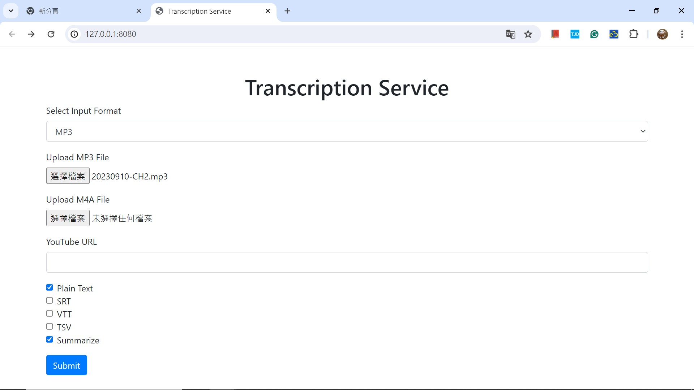

# IntroToAI_Final_Project
**Team:**  YYYYY
**Team members:**

## Introduction
Many people face a common challenge: the abundance of online asynchronous courses in computer science can be overwhelming, and it's hard to keep up with all the content every week. Therefore, for this final project, we aim to create a tool for summarizing key points from speech-to-text conversion, allowing us to quickly grasp the important information even when we don't have time to watch all the online courses.

## Data
We used the [Mozilla Common Voice](https://commonvoice.mozilla.org/en/datasets?fbclid=IwZXh0bgNhZW0CMTAAAR1z372MU2KnLPG5cGIw6XL9kizcCS8EzX_p8ZJ1xaKbijpshorfzfYYpQM_aem_Ad9-T66vSVpHIc3i7Uh1cWkgsELb6tJPNCo3E2y_aFbYRvm6DFr6tvJNcfgCm-4iZUfnGMrYKL6thOeGDk1TtzkP) dataset because it includes Traditional Chinese data and has been used in multiple top-tier conference papers.

## Main Approach
We used four models in total. The baseline model, which is a basic CNN with fully connected layers, and the CNN + LSTM model were both written and trained by us. DeepSpeech and Whisper are two of the most well-known speech-to-text models available online. We adapted these models to suit our needs and compared their performance.

0. Baseline: CNN
1. CNN + LSTM Model
2. PaddleSpeech Model
3. Whisper Model 

## Application
In the application directory, you will find our application: a tool that uses OpenAI's Whisper and ChatGPT API to convert lecture audio into summarized key points.
### Usage:
1. Install the required packages:
   ```sh
   pip install -r requirements.txt
   ```
2. Insert your ChatGPT API key in `app-boot.py` on line 24:
   ```python
   openai.api_key = 'your-api-key-here'
   ```
3. Run `app-boot.py`:
   ```sh
   python app-boot.py
   ```
4. If the application runs successfully, you will see the following screen:
   
